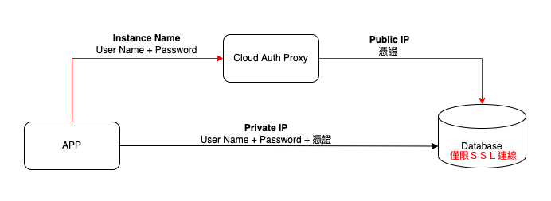

# Cloud Auth Proxy

### 說明
藉由 Auth Proxy 代理資料庫ＳＳＬ連線，省去管理憑證麻煩
- 可直接使用 IAM 做連線權限控制
- 使用TLS 1.3
- 代理 SSL certificate 處理
 - 支援所有GCP Cloud SQL
   - MySQL (pymysql) 
   - PostgreSQL (pg8000)
   - SQL Server (pytds) 

### 使用限制
 - 需同時啟用 Public IP & Private IP

### 安裝套件
 - cloud-sql-python-connector
 - sqlalchemy
 - pg8000

### 前置作業
 - 設定 VPC

### 資料庫設定
- 開啟 Public IP：不需設定連線白名單
- 開啟 Private IP：設定vpc
- 開啟 僅允許ＳＳＬ連線

### Cloud Run 設定
- 掛入要連線的資料庫
- 設定vpc (同資料庫設定)

